# MSR_PRACTICA_3

## Graficas:

### Grafica aceleracion - tiempo:

- Ejes:

    Eje X: Tiempo (s)

    Eje Y: Aceleración (m/s²)

    Líneas: Aceleración en los ejes X (rojo), Y (verde) y Z (azul).

- Análisis:

    Se observa un aumento brusco en la aceleración en los tres ejes alrededor del segundo 60-90. Esto indica una fase de movimiento o arranque del robot.

    La aceleración Z (azul) se mantiene generalmente en torno a 10 m/s², lo cual es coherente con la aceleración gravitatoria, pero con picos superiores debido probablemente a baches durante el movimiento.

    La aceleración en X e Y muestra oscilaciones intensas y cambios de dirección, lo que sugiere que el robot hizo giros, frenadas o cambios de velocidad bruscos.

    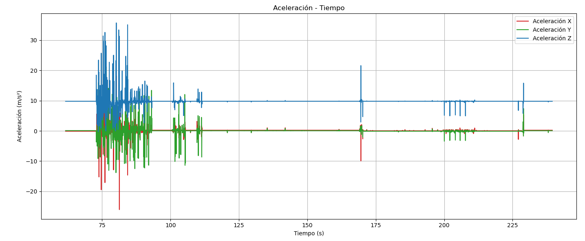

### Grafica posicion de ruedas - tiempo

- Ejes:

    Eje X: Tiempo (s)

    Eje Y: Posición angular (rad)

    Línea morada: posición angular del joint left_back_wheel_joint (representando el movimiento de las ruedas).

- Análisis:

    Al principio la posición angular se mantiene en 0, indicando que el robot no se movía.

    Luego desciende abruptamente entre 0 y 20 segundos, lo que indica que el robot avanza en una dirección durante un tiempo sostenido.

    Se mantiene en valores negativos constantes después del segundo 50, lo que indica que el robot estuvo detenido, sin cambio de posición en las ruedas.

    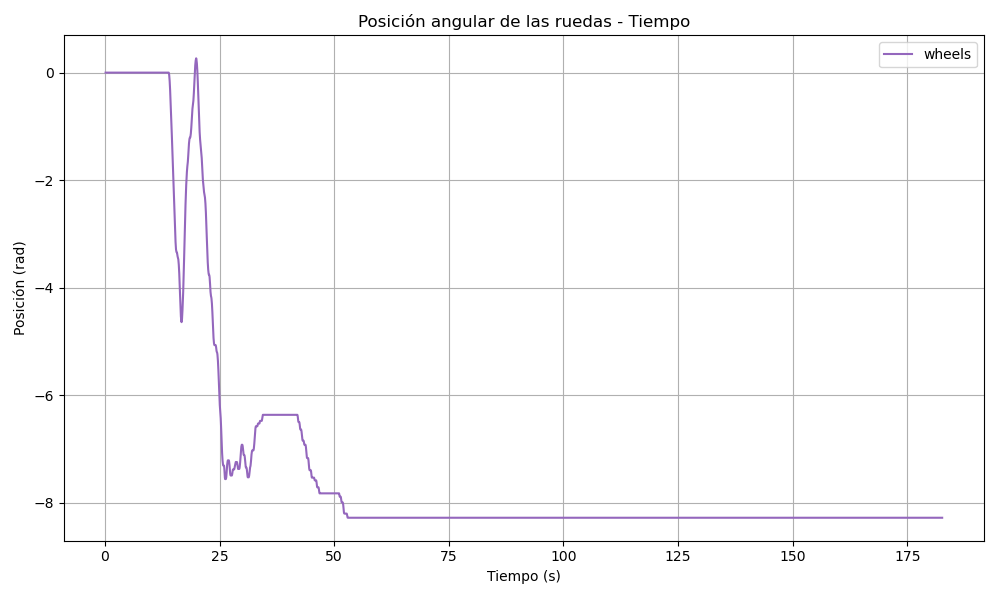

### Grafica gasto(G) - tiempo:

- Ejes:

    Eje X: Tiempo (s)

    Eje Y: G (suma del valor absoluto de los torques de las articulaciones del brazo SCARA).

- Análisis adaptado:

    Entre los segundos 10 y 40, se observa una intensa actividad en el brazo, con picos de gasto energético que superan los 2500. Esto corresponde al gasto generado por el brazo scara para mantener la posicion en la que se encuentra dle robot, lo que indica que de los segundos 10 a 40 el coche se esta dirigiendo a los cubos y posteriormente de los segundos 100 hasta el final del rosbag comienza a realizar los movimientos para coger los cubos.

    A partir del segundo 100 se alternan fases de actividad alta y baja, esto es debido a que el brazo realiza tareas intermitentes en este caso realiza movimientos de precision en el que se dirige hacia el cubo, el gripper se cierra, el scara se mueve hacia el centro del vehiculo para depositar el cubo y posteriormente el scara vuelve a su posicion inicial.

    La última parte del gráfico muestra una reducción casi completa del gasto, indicando que el brazo ha completado su tarea.

    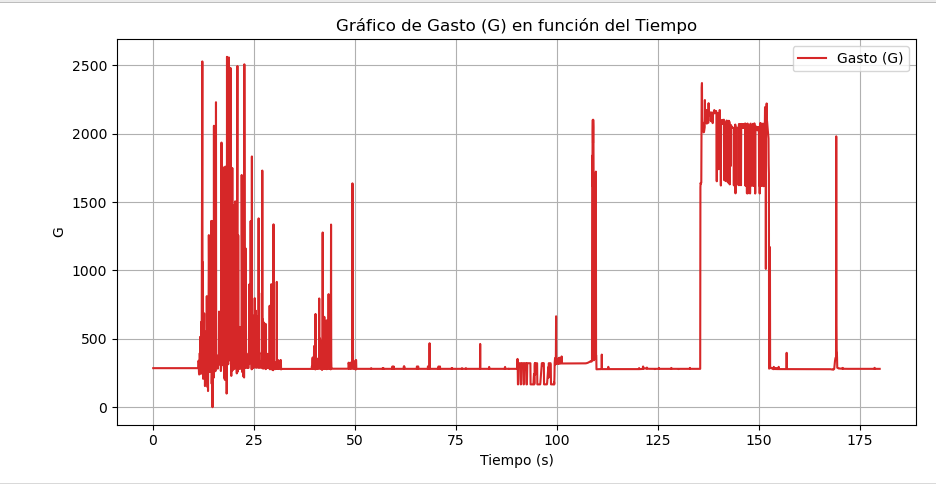

## Planes de SCARA y gripper:

Estos son los planes que he prohramado a mi SCARA y gripper para realizar todas las acciones correctamente:

- El gripper tiene dos planes a ejecutar:
    - open: Abre el gripper
    - close: Cierra el gripper

- El scara tiene 4 movimientos a seguir:
    - hold: Mantiene el brazo en posicion inicial
    - take: El brazo baja para coger el cubo
    - lobby: El brazo se coloca en la parte de atrs del coche
    - deposit: EL brazo coloca el cubo en el vehiculo de forma precisa

### Accion del robot:

Ahora me dispongo a mostrar las fases por las que pasa el robot a la hora de coger el cubo:

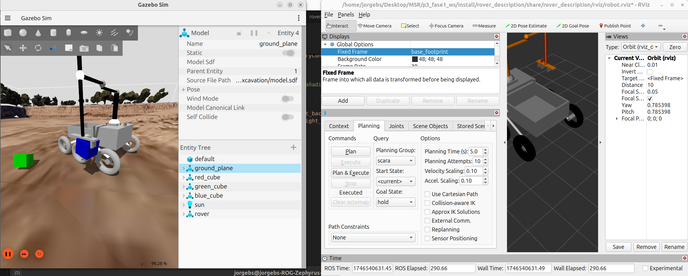
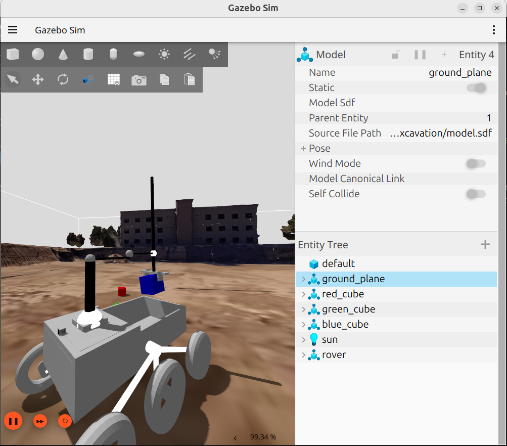
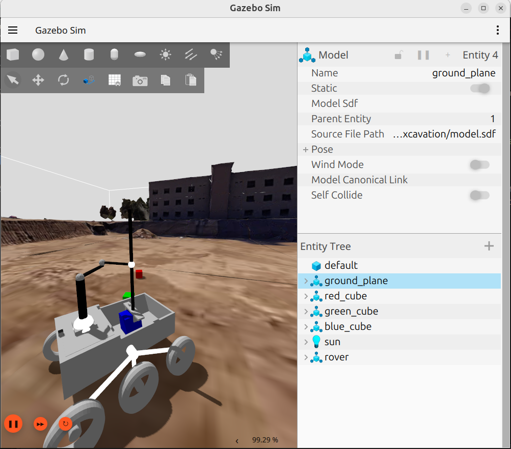
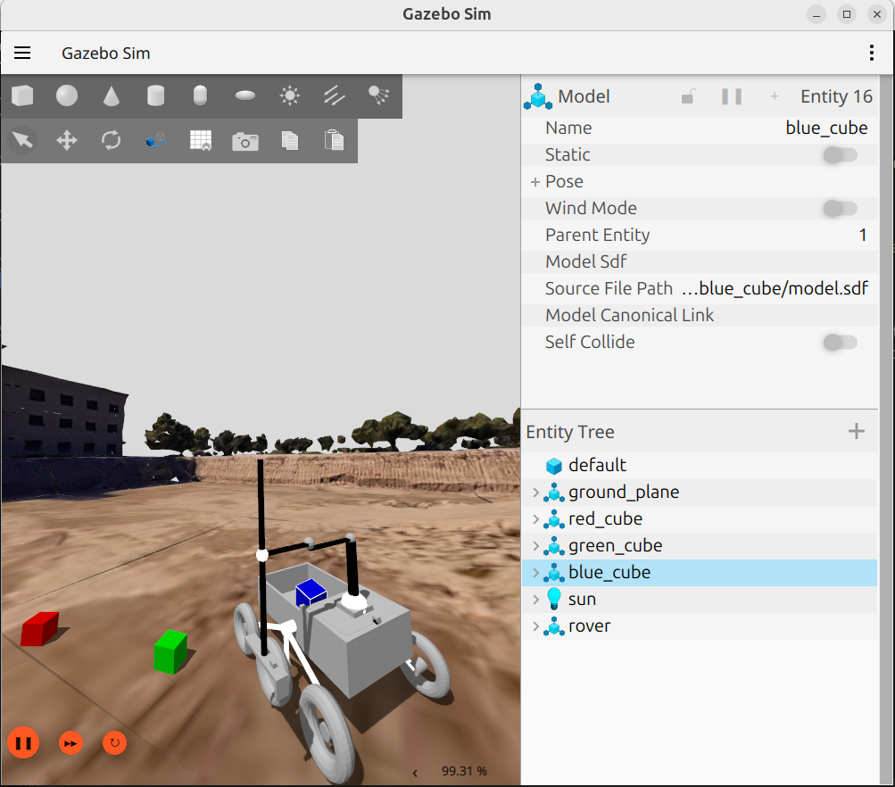

### Vision de camaras:

Aqui muestro una imagen de como se ven ambas camaras en el robot:

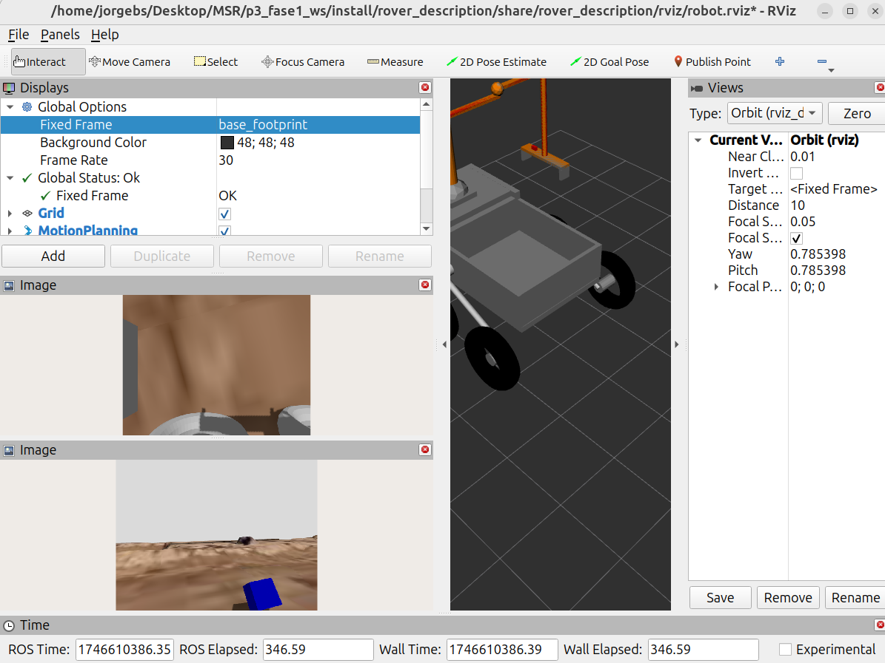

### vision del robot en rviz con tf:

Esta es la imagen del vehiculo con sus tf:

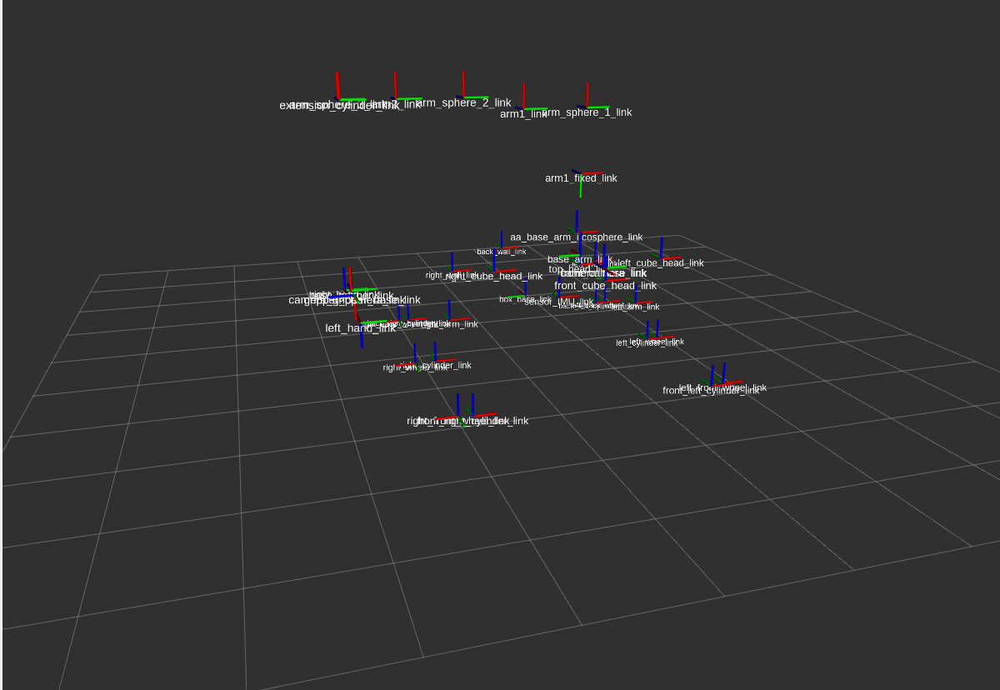

Y este es el visual:

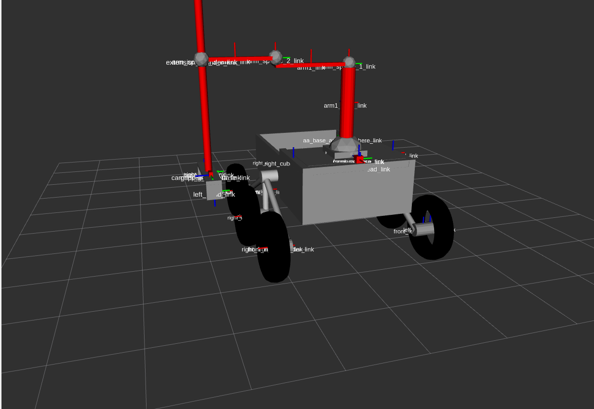

Esta imagen es con los sliders de la parte A:

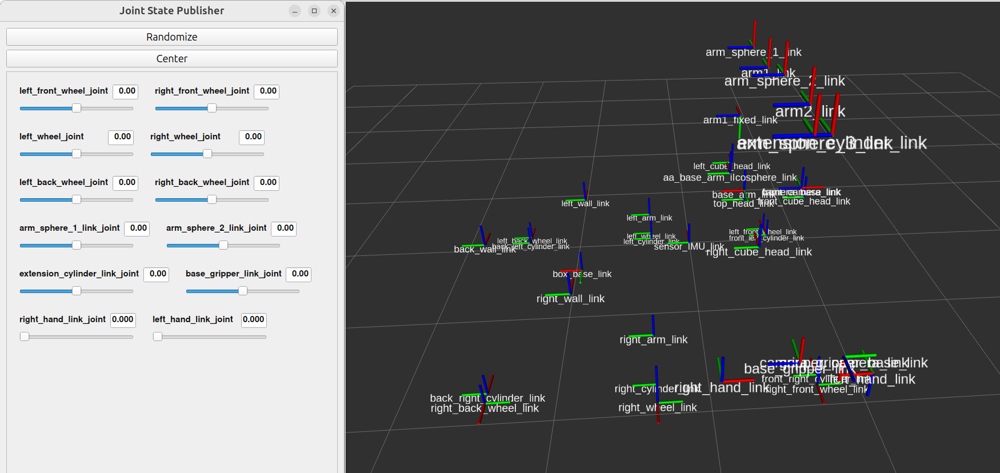
